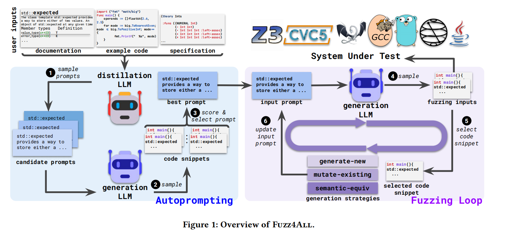
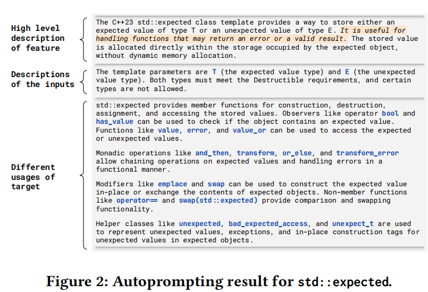
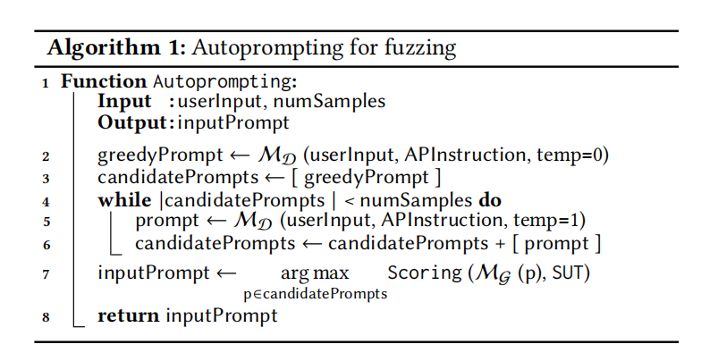
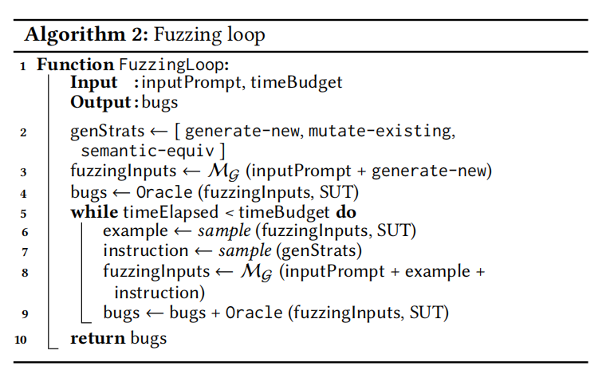
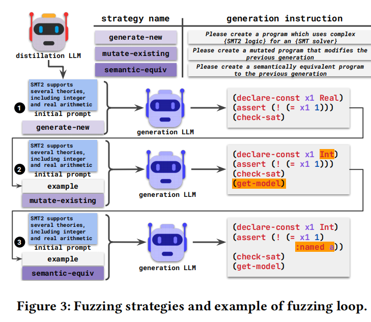
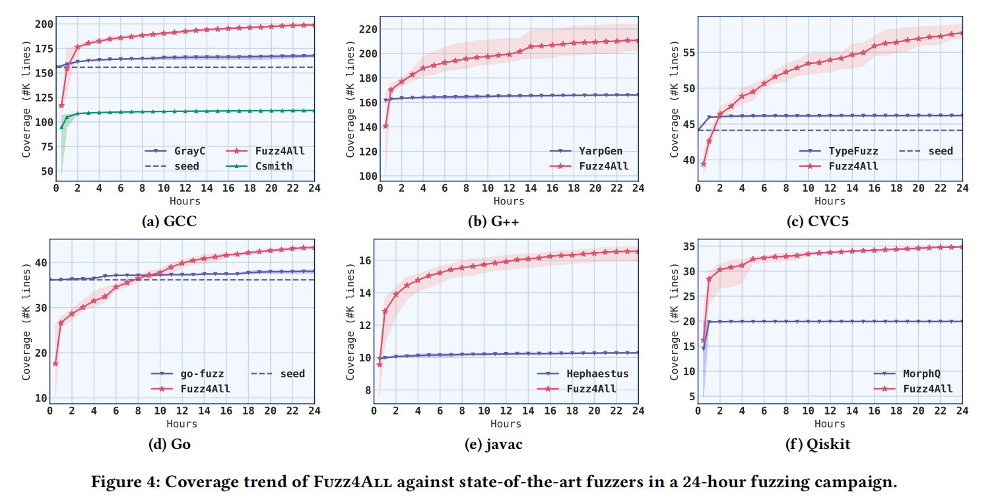

- # Fuzz4ALL: Universal Fuzzing with Large Language Models

  ## 1. 论文背景与动机

  传统模糊测试在发现以编程语言为输入的系统中存在三大局限，这正是Fuzz4ALL工作的动机：

  - **C1: 与特定语言/系统紧耦合**：传统模糊测试工具通常专为某一语言设计，开发耗时极长，难以复用到其他语言。
  - **C2: 缺乏对语言演化的支持**：工具针对特定语言版本设计，难以测试新引入的语言特性。
  - **C3: 生成能力受限**：无论是基于生成还是基于变异的方法，都受限于预定义的语法或变异算子。

  **核心动机**：利用大语言模型（LLM）作为通用的"输入生成与变异引擎"，以克服传统方法的局限性，实现能针对多种输入语言及其不同特性进行测试的**通用模糊测试器**。

  ## 2. 核心工作原理

  Fuzz4ALL是首个基于LLM的通用模糊测试框架，整体流程分为**自动提示生成**和**LLM驱动的模糊测试循环**两大核心阶段。

  ### 2.1 系统整体架构

  Fuzz4ALL框架的整体架构如下图所示：

  

  *（图1：Fuzz4ALL系统工作流程，展示了从用户输入到测试生成的完整流程）*

  系统接收三类用户输入：**文档**、**示例代码**和**规范**。这些输入经过**蒸馏LLM**处理后，生成高质量的初始提示，再由**生成LLM**根据提示生成具体的测试代码片段。生成的测试输入随后被提交给**系统待测试部分**（SUT），支持多种编程语言和工具，如Z3、CVC5、GCC、Go等，体现其"多目标"特性。

  ### 2.2 自动提示生成阶段

  由于原始文档可能冗长，直接用作给LLM的提示效果不佳。Fuzz4ALL使用一个**蒸馏LLM**，通过"自动提示"技术，将用户输入蒸馏、总结成一个简洁、信息丰富的提示。

  **图2展示了自动提示生成的具体结果**：

  

  *（图2：针对C++23的std::expected类模板的自动提示生成结果）*

  图中展示了自动提示的三个核心部分：

  1. **高级特性描述**：说明std::expected用于存储预期值或意外值
  2. **输入描述**：列出模板参数、类型约束、成员函数等详细信息
  3. **目标的不同用法**：包括构造、赋值、访问、单子操作、修饰符等多种使用方式

  自动提示生成的具体算法如下：

  **算法1：自动提示生成算法**

  

  *（图3：自动提示生成算法伪代码）*

  该算法通过蒸馏LLM（M_D）生成多个候选提示，然后通过评分函数选择最佳提示（评分基于生成LLM能产生多少被SUT接受的有效代码的数量）。

  ### 2.3 基于LLM的模糊测试循环

  在获得初始提示后，系统进入模糊测试循环阶段，利用**生成LLM**持续生成多样化的测试输入。

  **模糊测试循环算法**如下：

  

  *（图4：模糊测试循环算法伪代码）*

  在每次循环迭代中，系统会动态更新给生成LLM的提示。更新方式是在**初始提示**后附加两部分内容：

  1. **一个示例**：从之前生成的、被SUT判定为有效的测试输入中随机选择一个
  2. **一条生成策略指令**：随机从三条策略中选择一条，指导LLM如何处理示例

  **图5展示了模糊测试策略及循环示例**：

  

  *（图5：模糊测试策略及循环示例，展示三种策略在实际循环中的运用）*

  图中详细展示了三种生成策略：

  - **generate-new**：生成全新的测试输入
  - **mutate-existing**：对提供的示例进行变异
  - **semantic-equiv**：生成与示例语义等价的输入

  ## 3. 论文工作的实现与实验

  ### 3.1 实现细节

  Fuzz4ALL使用Python实现，核心代码仅872行。使用GPT-4作为蒸馏LLM进行自动提示，使用StarCoder作为生成LLM进行测试输入生成。

  ### 3.2 实验设计

  为验证通用性，在**6种输入语言**（C, C++, SMT2, Go, Java, Python）和**9个真实世界SUT**上进行了评估，包括GCC/Clang编译器、Z3/CVC5求解器、Go工具链、OpenJDK Java编译器、Qiskit量子计算平台。针对每种语言，与当前最先进的、专为该语言设计的模糊测试工具进行对比。

  ## 4. 主要结果与贡献

  ### 4.1 实验结果

  Fuzz4ALL在所有被测语言上进行了24小时的模糊测试实验，并以代码覆盖率为指标与现有先进模糊测试工具进行对比。

  **图6展示了Fuzz4ALL与先进模糊测试工具的覆盖率趋势对比**：

  

  *（图6：覆盖率趋势对比图，展示在多个被测系统上的覆盖率变化）*

  从图中可以看出：

  - Fuzz4ALL在大多数被测系统（尤其是GCC、G++、CVC5、Go）上，覆盖率随测试时间增长而显著上升
  - 最终覆盖率高于对比工具
  - 在Qiskit上，Fuzz4ALL起始覆盖率约10K行，快速上升后在25K行左右趋于平稳，而MorphQ起始约15K行，但保持平稳

  ### 4.2 主要贡献

  1. **有效性**：在所有被测语言上，Fuzz4ALL的平均代码覆盖率比最先进的基线工具高出**36.8%**，并且覆盖率随时间持续增长，未出现平台期。
  2. **通用性与定向测试能力**：实验证明了Fuzz4ALL可轻松应用于多种语言。通过提供不同的用户文档，它能有效进行**通用测试**和**针对特定特性的定向测试**。
  3. **实际缺陷发现**：在9个SUT中累计发现了**98个真实缺陷**，其中**64个已被开发者确认为先前未知的bug**，展现了强大的实践价值。
  4. **核心贡献**：提出了首个利用LLM进行通用模糊测试的框架；设计了自动提示生成阶段；开发了基于LLM的、可迭代更新提示的模糊测试循环。

  ## 5. 结论

  Fuzz4ALL是首个基于大语言模型的通用模糊测试框架，通过自动提示生成和LLM驱动的模糊测试循环，成功克服了传统模糊测试方法的局限性。实验证明，该框架不仅具有出色的通用性，能够轻松应用于多种编程语言和工具，而且在代码覆盖率和缺陷发现能力方面显著优于现有最先进的专用模糊测试工具。该方法为基于LLM的软件测试自动化提供了新思路，尤其在复杂API和语言特性的测试生成上表现出较强潜力。