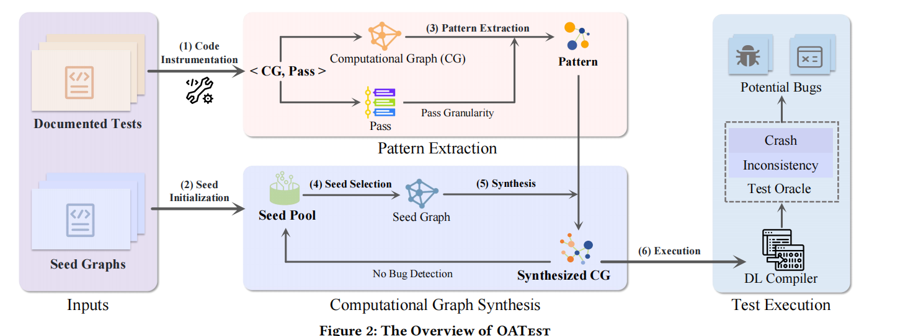

# OATest工具改进

## 局限性

## 1. 模式来源局限：依赖文档化测试（Documented Tests）导致数量受限

模式（Pattern）的提取是 OATest 能够“感知优化”的基础，但完全依赖开发者编写的测试用例确实存在明显的瓶颈：

- **“长尾”优化覆盖不足：** 深度学习编译器（如 TVM）包含数百个优化 Pass。虽然核心优化（如算子融合、布局转换）在官方文档和测试套件中有丰富的用例，但许多针对特定硬件、特定算子组合或边缘情况的优化，其文档化测试可能非常稀缺。由于模式提取算法只能“见所未见”，这导致 OATest 无法为这些缺乏样板代码的优化生成有效的测试。
- **人类思维的局限性：** 开发者编写测试用例时，通常遵循特定的逻辑习惯或针对已知的典型故障点。这意味着提取出的模式往往是“常规”的。如果某些 bug 隐藏在极其反常规、甚至是不符合逻辑的复杂图结构中，仅靠提取现有模式很难触达这些搜索空间。
- **静态模式的生命周期：** 随着编译器版本的迭代，旧的文档化测试提取出的模式可能已经不再是当前版本的优化重点。如果模式库没有持续、自动地更新，测试生成的有效性会随时间衰减。

## 2. 插入策略局限：强约束匹配导致生成图的种类受限

您提到的“并非完全随机，而是寻找相同输入输出部分插入”，这确实是 OATest 为了保证**有效性（Validity）而牺牲了多样性（Diversity）**：

- **结构僵化：** 为了确保插入模式后计算图仍能正常运行且能触发目标优化，OATest 倾向于寻找在形状（Shape）和数据类型（Dtype）上高度兼容的锚点（Anchor points）。这种“按方抓药”的方式虽然提高了测试用例的通过率，但限制了模式与环境之间产生“化学反应”的可能性。
- **上下文耦合度低：** 这种插入方式更多是在进行“子图替换”或“子图嵌入”。由于模式内部结构相对固定，它与种子图（Seed Graph）其他部分的交互往往仅限于连接处的几个节点。这限制了生成更为复杂的、跨越多个算子边界的全局性优化错误检测能力。
- **搜索空间的窄化：** 相比于像 NNSmith 这种完全随机或基于约束求解的生成策略，OATest 的生成逻辑是在一个预设的“安全区”内跳舞。虽然它比完全随机生成更有针对性，但也失去了探索那些“虽然输入输出不完全匹配，但通过类型转换或重新排列可能触发深层 Bug”的潜在场景。

## 解决方案（初步）

## 方案一：LLM 模式生成 + 正反馈循环 (强化学习/引导式 Fuzzing)

这是一个非常出色的想法。你实际上是在描述一个**基于覆盖率/Bug引导的大语言模型 Fuzzing 框架**。

- **优势与可行性：** * **突破数量瓶颈：** 论文中 OATest 只能提取几千个固定的模式 。使用 LLM 可以基于这些已知模式进行变异和推理，生成无穷无尽的“变体”模式，彻底解决文档化测试数量有限的问题。
  - **正反馈循环的威力：** 将触发新 Bug 或覆盖新代码分支的模式重新喂给 LLM（作为 In-context learning 的样本或进行微调），这类似于强化学习中的奖励机制。这能引导 LLM 逐渐向更容易出错的优化逻辑（如复杂的算子融合 ）集中火力。
- **需要警惕的现实挑战：**
  - **“幻觉”导致的无效测试：** 论文中对比的 WhiteFox 和 LLMTest（都是基于 LLM 的工具）最大的问题就是效率极低，因为 LLM 经常产生“幻觉”，导致生成的测试超过一半都是无效的，在进入优化阶段前就被编译器拒收了 。
  - **应对策略：** 你的方案比 WhiteFox 更好，因为你是让 LLM **基于已有的合法模式进行修改**，而不是凭空生成。此外，可以在 LLM 生成模式后，强制加上一层轻量级的语法/类型检查器，过滤掉明显的废图，再投入测试。

------

## 方案二：采用类似 NNSmith 的方法，将 Pattern 与种子图随机组合

这里我需要稍微澄清一下论文中的技术细节，然后顺着你的思路给出一个更硬核的落地方式。

- **现实情况澄清：** 实际上，OATest **已经**在使用 NNSmith 生成种子图了 ，并且它在插入模式时，**插入点（Synthesis Point）确实是随机选择的** 。
- **为什么 OATest 不敢“完全随机拼接”？** * 如果完全随机地将模式的输入/输出接到种子图上，会立刻导致计算图失效 。因为深度学习计算图的约束极其严格：张量（Tensor）的形状（Shape）和数据类型（Dtype）必须严丝合缝 。如果不去刻意寻找匹配的部分，图根本跑不起来，也就谈不上触发优化了。OATest 甚至为了连上不匹配的节点，不得不强行插入 Padding（填充）、Reshape（重塑）和 Retype（类型转换）等桥接算子 。
- **对你方案的升级优化（基于 NNSmith 的核心技术）：** 你提到的“采用类似 NNSmith 的方法”是一个极具潜力的方向。NNSmith 能够保证多样性且保证图 100% 有效的核心魔法，是**约束求解（Constraint Solving）** 。
  - 与其像 OATest 那样“先生成种子图，再把模式硬塞进去（塞不进去就加桥接节点）”，**不如把你的模式（Pattern）直接转化为一组固定的约束**。
  - 我们可以把这段 Pattern 作为一个不可更改的“核心黑盒”扔给 NNSmith 的约束求解引擎，让 NNSmith 以这个 Pattern 为中心，向外**动态生成**它的上游输入和下游输出（即动态生成种子图）。
  - 这样一来，既保证了 Pattern 绝对存在（触发优化的先决条件），又利用了 NNSmith 的特性生成了千奇百怪、但 100% 合法且无需桥接算子的上下文环境（极致的多样性与有效性）。

### 局限性

## 1. 优化特征的“稀释”效应 (Pattern Dilution)

深度学习编译器的优化通常要求计算图具有极高的“局部纯净度”。

- **问题：** NNSmith 生成的种子图通常包含大量随机算子、奇怪的形状变换（Reshape）或冗余的维度操作。当你把一个精心设计的 Pattern 随机放入这样一个“嘈杂”的图中时，Pattern 原有的结构特征可能被周围的随机算子掩盖。
- **后果：** 编译器在扫描图进行模式匹配（Pattern Matching）时，可能因为 Pattern 的输入来自一个过于复杂的子图，或者输出被连接到一个阻断优化的算子，从而判定该区域不符合优化条件。

## 2. 前置 Pass 的“破坏性”改写 (Interference by Pre-optimization)

在目标优化（Target Optimization）执行之前，编译器会先运行一系列基础的简化（Simplification）和规范化（Canonicalization）Pass。

- **问题：** 种子图越多样、越随机，触发这些前置 Pass 的可能性就越大。这些基础优化可能会为了合并常量或消除冗余，改变你注入的 Pattern 的局部结构。
- **后果：** 你的 Pattern 可能还没等到目标优化 Pass 运行，就被前置 Pass “修剪”得面目全非，导致最终无法触发目标优化。

## 3. “有效性”与“触发率”的博弈

NNSmith 的核心是通过约束求解（Constraint Solving）保证图的**合法性（Validity）**，即不崩溃。但这并不等同于保证**优化的激活（Activation）**。

- **客观现实：** * **OATest 策略：** 倾向于寻找与 Pattern 极其相似的现有结构进行替换，这是一种“近亲结婚”，虽然多样性低，但环境温和，触发率高。
  - **方案二策略：** 将 Pattern 强行塞入一个完全陌生的随机环境。根据 OATest 论文的数据，仅仅是随机选择注入点，就已经有 8.64% 到 24.51% 的失效。如果完全按照 NNSmith 的逻辑进行更大胆的随机组合，这个失效比例**客观上一定会大幅上升**。

## 解决方案

## 1. 建立“优化保护区”（Optimization Protection Zone）

- **方法：** 在利用 NNSmith 生成上下文时，为 Pattern 块设定一个“隔离半径”。
- **细节：** 确保 Pattern 的直接前驱和后继算子是“优化友好”的（例如：避免在需要算子融合的 Pattern 后面紧跟一个具有副作用或阻断融合的算子，如 `Unique` 或复杂的 `Control Flow`）。

## 2. 语义感知的属性对齐

- **方法：** 许多优化（如向量化）对 Tensor 的形状有隐性要求（如必须是 8 或 16 的倍数）。
- **细节：** 在 LLM 生成或 NNSmith 合成过程中，将这些“优化触发必备属性”设为强约束。多样性应体现在**拓扑结构**上，而非破坏**优化所需的关键数值特征**。

## 3. 多阶段验证过滤

- **方法：** 在大规模运行差异测试（Differential Testing）之前，先通过一个“轻量级预检”。
- **细节：** * **Level 1：** 检查编译器的 `Optimization Log`，确认目标 Pass 是否被命中。
  - **Level 2：** 如果命中，再进行全量的推理验证。
  - **价值：** 这样可以快速剔除那些由于多样性过高而失效的测试用例，将算力集中在“有效且多样”的图上。