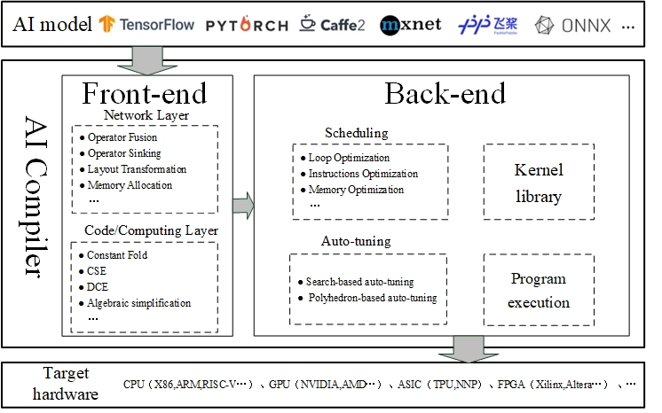

<<<<<<< HEAD
# Information and Software Technology A Review of AI compiler Design and Optimization
=======
# 论文阅读

## **Information and Software Technology**——**A Review of AI compiler Design and Optimization**

### AI编译器架构详解

#### 核心思想：分层优化

这个架构的核心是**分层优化**。编译器将复杂的编译过程分解为多个层次，每个层次专注于一类特定的优化，使得整个系统更加模块化、可维护且强大。

整个流程可以看作是从**高级计算图** 到**底层硬件指令** 的转换与优化过程。

#### 第1层：前端 - 计算图优化

**目标**：接收来自深度学习框架（如PyTorch）的定义，构建一个计算图，并进行与硬件无关的高层优化。

这一层主要在**计算图** 层面进行操作。

##### 网络层优化
- **Operator Fusion（算子融合）**：将多个小算子合并成大算子，减少内核启动开销
- **Operator Sinking（算子下沉）**：将操作向后推，减小影响范围
- **Layout Transformation（布局转换）**：优化数据内存排列顺序
- **Memory Allocation（内存分配）**：规划张量内存生命周期，复用内存

##### 代码/计算层优化
- **Constant Fold（常量折叠）**：编译时计算常量表达式
- **CSE（公共子表达式消除）**：消除重复计算
- **DCE（死代码消除）**：删除无用代码
- **Algebraic simplification（代数简化）**：利用代数恒等式简化计算

#### 第2层：后端 - 硬件相关优化

**目标**：将优化后的计算图映射到**特定目标硬件**上，生成高效底层代码。

##### 调度优化
- **Loop Optimization（循环优化）**：循环分块、展开、交换、向量化
- **Instructions Optimization（指令优化）**：选择高效硬件指令
- **Memory Optimization（内存优化）**：优化数据访问模式

##### 自动调优技术
- **Search-based auto-tuning**：基于搜索的自动调优（如TVM Ansor）
- **Polyhedron-based auto-tuning**：基于多面体模型的自动调优

#### 第3层：内核库

**目标**：提供高度优化的基础算子例程

- 手动精心优化的核心算子
- 与编译器生成代码混合使用
- 调用专业库（如cuDNN、oneDNN）

#### 目标硬件平台

- **CPU**：x86, ARM, RISC-V - 注重指令级并行
- **GPU**：NVIDIA, AMD - 注重大规模数据并行
- **ASIC**：TPU, NNP - 专用AI芯片
- **FPGA**：Xilinx, Altera - 可配置硬件

#### 架构优势

1. **前端**："做什么"的优化，图级变换简化计算
2. **后端**："怎么做"的优化，硬件相关优化
3. **内核库**：性能基石，提供优化算子
4. **自动调优**：应对复杂硬件环境

---

### 计算图与算子基础

#### 计算图概念

- **作用**：描述计算任务的有向图
- **组成**：
  - **节点** = 算子（具体计算操作）
  - **边** = 数据流动方向，体现**计算依赖关系**

#### 算子定义

- **定义**：计算的基本单元，代表特定数学运算
- **常见类型**：
  - 数学运算：矩阵乘法、卷积、激活函数
  - 数据处理：数据加载、格式转换
  - 优化算法：梯度下降、Adam优化器

#### 工作流程

1. 定义计算图（算子+连接关系）
2. 建立依赖关系（输入输出顺序）
3. 按依赖顺序执行算子

#### 重要性

- 支持自动微分（反向传播）
- 便于性能优化（算子融合、内存复用）
- 实现跨平台部署

#### 简单理解

- 计算图 = 食谱
- 算子 = 烹饪步骤  
- 依赖关系 = 步骤先后顺序

# 精读

### **🔍 精读部分中文翻译**

#### **1. 摘要**

**背景**：现阶段，一方面AI的快速发展产生了大量的模型和算法，另一方面摩尔定律逐渐失效，模拟计算、量子计算、存内计算等一系列新型计算机架构不断涌现。这两方面导致了在新硬件架构上高效部署AI模型的真实需求，AI编译器在此背景下应运而生。

**目标**：本文介绍了AI编译器的通用框架，描述了AI编译器的组成部分和整体流程，分类介绍了各种优化技术，最后介绍了现阶段工业界和学术界一些有代表性的AI编译器。

**方法**：我们从前端优化、后端优化和中间表示等几个方面，介绍了AI编译器的相关技术，并按照本文的分类方法对近年来AI编译器相关的论文进行了梳理和介绍。

**结果**：目前AI编译器的整体框架较为统一，与传统编译器相比，它更注重多级IR的划分和针对特定后端的优化，尤其是基于搜索的自动调优技术，是近年来的研究热点。

**结论**：根据本次文献调查的结果，目前针对AI编译器的前端优化技术和IR设计的研究还相对较少，存在许多新兴领域有待研究，例如多级IR的统一、生态整合以及多面体技术与自动调优的结合。

------

#### **2. AI编译器通用架构**

AI编译器的通用架构如图1所示，通常由两个核心组件构成：**编译器前端**和**编译器后端**，分别针对硬件无关和硬件相关的处理。在这两个组件之间，**中间表示** 扮演了桥梁的角色。

由于传统编译器中的IR无法很好地描述AI模型中的复杂计算表达式，现有的AI编译器采用**多级IR设计**以进行高效的代码优化。通常，在AI编译器的处理流程中，AI模型会被转换为多个级别的IR。编译器前端的IR称为**高层IR**，它包含硬件无关的抽象信息，用于表示神经网络中的计算图，因此也被称为图IR。AI编译器的前端基于高层IR执行硬件无关的转换和优化。编译器后端的IR称为**低层IR**，它更接近目标硬件的具体实现，AI编译器的后端基于低层IR执行硬件相关的优化、代码生成和编译。

通过这种分层设计，AI编译器能够灵活处理不同复杂度的AI模型，并在不同硬件平台上实现高效的代码生成和执行。

------

#### **3. 中间表示**

**高层IR** 可独立于目标硬件设计，因而是AI编译器模块中标准化和可复用性较高的部分。计算图用于表示深度学习网络模型在训练和推理过程中的计算逻辑和状态，它由基本数据结构**张量** 和基本操作单元**算子** 组成。

- **静态计算图**：模型的结构和计算流程一旦定义即固定不变。适用于对模型结构和计算过程进行优化和静态分析的场景，常见于TensorFlow等框架。
- **动态计算图**：结构和计算流程可根据输入数据动态改变。此类计算图常用于PyTorch等动态图框架，更灵活，便于定义和调试模型。

**低层IR** 与高层IR的主要区别在于：高层IR的中间数据项是大型多维张量，而低层IR的中间数据项是各种类型的变量；低层IR能够以更细粒度的方式描述AI模型的计算，并通过提供计算调度和内存访问能力来实现目标相关的优化。

- **基于Halide的IR**：基本理念是**计算与调度分离**。使用Halide的编译器不会直接给出具体方案，而是自动搜索并尝试可能的调度选项以确定最佳方案。
- **基于多面体的IR**：是一种并行编译领域的数学抽象，使用线性规划、仿射变换等数学方法优化具有边界和分支的静态控制流的循环代码，以改变循环顺序、消除依赖性并提高并行性。
- **其他**：例如，MLIR引入了**方言** 来表示这些多级抽象，每个方言由一组定义良好的不可变操作组成，并支持方言之间的灵活转换。

------

#### **4. 前端优化**

AI编译器的前端优化是通过遍历计算图节点并通过各种**PASS**执行图变换来实现的。

**网络层优化**：

- **算子融合**：将网络模型中的几个小算子合成一个大算子，从而解决模型训练过程中读入数据量过大的问题，减少Kernel的调度和内存访问。
- **算子下沉**：将计算图中的算子移动到更靠近数据源的位置，从而减少数据传输距离，降低内存占用，提高模型执行效率。
- **布局转换**：寻找用于存储计算图中张量的最优数据布局。请注意，此阶段并不实际执行布局转换，而是将布局转换节点插入计算图中，并在编译器后端优化期间执行。
- **内存分配**：AI模型训练需要大量内存空间。内存分配的优化可以显著提高程序的性能和效率，并减少内存使用。

**代码/计算层优化**：

- **常量折叠**：将计算图中可以预知输出值的节点替换为常量，并对计算图进行一些结构简化。
- **公共子表达式消除**：通过在计算图中搜索具有相同结构的子图来简化计算图的结构，从而减少计算开销。
- **死代码消除**：消除计算图中的死节点，避免为它们分配存储和计算。
- **代数简化**：利用交换律、结合律等定律调整计算图中算子的执行顺序，或移除不必要的算子，以提高整体计算效率。

------

#### **5. 后端优化与自动调优**

**调度优化**：

- **循环优化**：包括循环展开、循环分块、循环重排序、循环融合和循环分裂。由于程序中循环频繁出现，对循环进行优化可以带来显著的性能提升。
- **指令优化**：包括**向量化**（将标量操作转换为向量操作）和**张量化**（利用硬件厂商提供的专用张量指令或算子库）。
- **内存优化**：包括**延迟隐藏**（重叠内存操作与计算）和**内存分配**（针对GPU等AI芯片中的复杂内存层次结构进行高效分配）。

**基于搜索的自动调优**：
由于硬件特定优化的参数空间巨大，必须使用**自动调优**来确定最佳参数配置。AI编译器中的自动调优通常分为三个步骤：

1. **搜索空间参数化**：对调度优化问题进行建模，搜索空间通常由可参数化转换的可能参数值组合构成。
2. **成本模型**：用于评估特定参数化下的调度性能，并指导搜索最优调度策略。主要实现方式有黑盒模型、基于机器学习的模型和基于仿真的预定义模型。
3. **搜索算法**：在搜索空间中找到实现最佳性能的参数配置。常用算法包括遗传算法、模拟退火算法和基于机器学习的算法。

**多面体技术与内核库**：

- 多面体编译技术的核心是**调度变换**。调度算法（如Feautrier算法、Pluto算法）旨在提高程序并行性和数据局部性。
- 为了实现对AI模型的高效计算，主流AI硬件厂商提供了高度优化的内核库。AI编译器可以在代码生成期间生成对这些库的函数调用，但将其视为黑盒也限制了跨算子的优化。

------

#### **6. 未来展望**

1. **解决生态碎片化问题**：当前AI编译器生态存在严重的碎片化问题。Google推出的MLIR在一定程度上缓解了此问题，但具体实现仍需产业界和学术界共同努力。
2. **为新型架构构建编译支持**：如何将越来越多的AI模型高效部署到模拟计算、存内计算、量子计算等新型架构中仍需探索。
3. **多节点任务划分**：在大模型趋势下，如何在多个节点上划分任务，并将划分后的任务合理映射到硬件架构以充分利用硬件资源能力，此类问题仍需持续研究。
4. **多面体技术**：将多面体建模和自动调优技术相结合来设计DL编译器是一个有前景的研究方向。
5. **对动态图的支持**：许多深度学习框架支持动态图，但大多数深度学习编译器目前主要针对静态图进行优化，因此需要更好地支持动态图以满足不同框架和应用的需求。
6. **自动调优**：现有的自动调优技术侧重于单个算子的优化。然而，局部最优的组合并不能导致**全局最优**。未来需要更全局的调优策略。

>>>>>>> 8e5943ae22cc1f3f09178c99e4cced5f0bffd977
